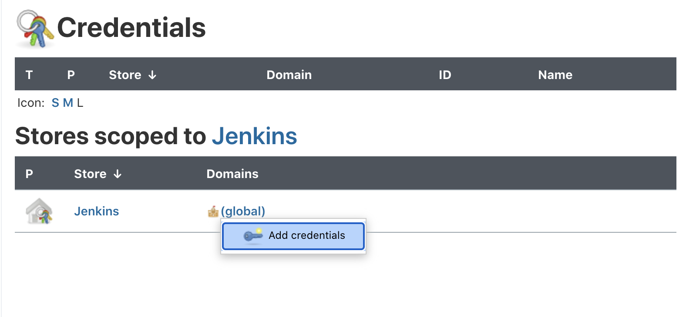
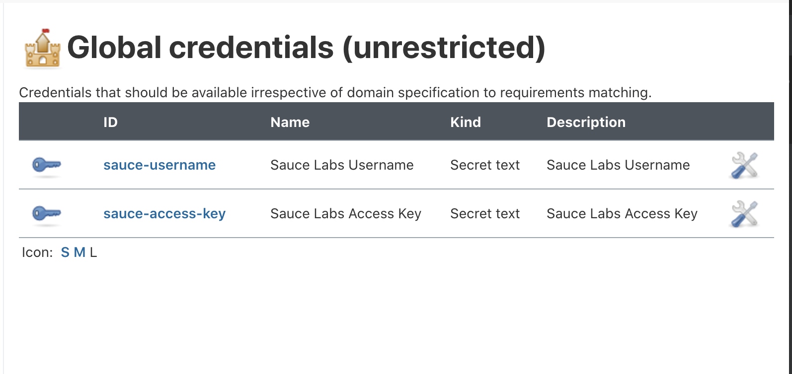
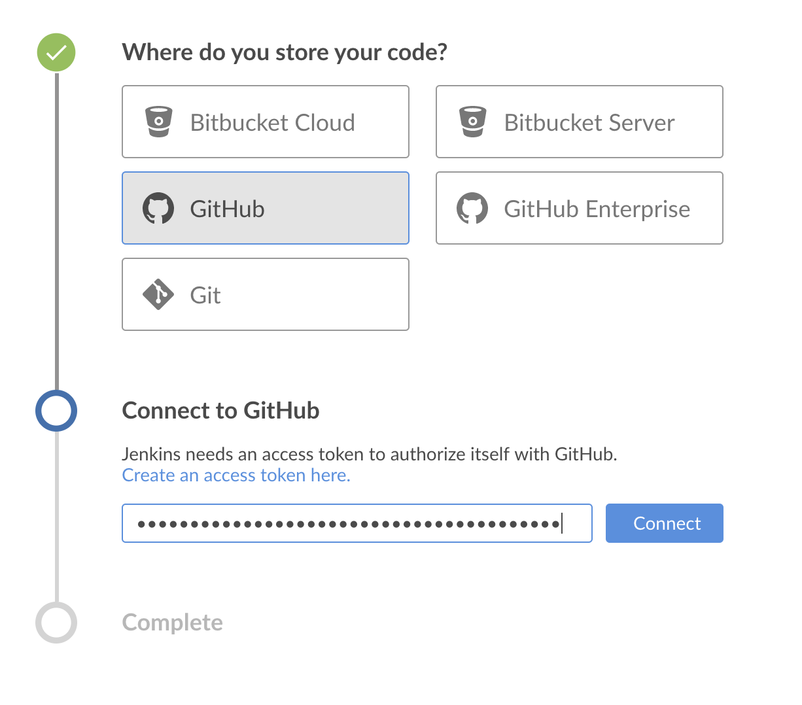

# jenkins-devx-example
Demonstration of using testrunner-toolkit / saucectl in a Jenkins pipeline.

## What You'll Need
This example uses the following tools:

* Puppeteer
* Docker
* Jenkins (in Docker)
* Sauce Labs (account credentials) 

## Table of Contents
* [Setup Jenkins](#setup-jenkins)
    * [Create Volume](#create-volume)
    * [Start Jenkins](#start-jenkins)
    * [Configure Sauce Labs Account Credentials](#configure-sauce-labs-account-credentials)
* [Setup Test and Configuration Files](#setup-test-and-configuration-files)
    * [Setup `saucectl` Config](#setup-saucectl-config)
    * [Create Example Tests](#create-example-tests)
    * [Add Jenkinsfile](#add-jenkinsfile)
* [Run Pipeline Tests](#run-pipeline-tests)
 
    
## Setup Test and Configuration Files

### Setup `saucectl` Config
1. `mkdir .sauce`
2. `touch puppeteer_parallel.yml`
3. `mkdir -p tests/e2e/puppeteer_parallel/`
    
   ```sh
   apiVersion: v1alpha
   metadata:
     name: Testing Puppeteer Parallelism Support
     tags:
       - e2e
       - release team
       - other tag
     build: Release $CI_COMMIT_SHORT_SHA
   files:
     - tests/e2e/puppeteer-parallel/
   suites:
     - name: "chrome"
       match: ".*.(spec|test).js$"
       capabilities:
         browserName: "chrome"
       settings:
         browserName: "chrome"
   image:
     base: saucelabs/stt-puppeteer-jest-node
     version: latest
   sauce:
     region: us-west-1
   parallel: true
   ```

### Create Example Tests

1. `touch tests/e2e/puppeteer_parallel/jenkins-pipeline-example-1.test.js`
    
    ```js
    describe('saucectl demo test 1', () => {
    	test('should verify title of the page', async () => {
    		const page = (await browser.pages())[0]
    		await page.goto('https://www.saucedemo.com/');
    		expect(await page.title()).toBe('Swag Labs');
    	});
    });
    ```
   
2. `touch tests/e2e/puppeteer_parallel/jenkins-pipeline-example-2.test.js`
    
    ```js
    describe('saucectl demo test 2', () => {
       test('should verify title of the page', async () => {
    		const page = (await browser.pages())[0]
    		await page.goto('https://www.saucedemo.com/');
    		expect(await page.title()).toBe('Swag Labs');
    	});
    });
    ```
   
3. `touch tests/e2e/puppeteer_parallel/jenkins-pipeline-example-3.test.js`
   
   ```js
   describe('saucectl demo test 3', () => {
   	test('should verify title of the page', async () => {
   		const page = (await browser.pages())[0]
   		await page.goto('https://www.saucedemo.com/');
   		expect(await page.title()).toBe('Swag Labs');
   	});
   });
   ```
   
4. `touch tests/e2e/puppeteer_parallel/jenkins-pipeline-example-4.test.js`

   ```js
   describe('saucectl demo test 4', () => {
   	test('should verify title of the page', async () => {
   		const page = (await browser.pages())[0]
   		await page.goto('https://www.saucedemo.com/');
   		expect(await page.title()).toBe('Swag Labs');
   	});
   });
   ```
   
### Add Jenkinsfile

1. `touch Jenkinsfile`
    
    ```sh
    pipeline {
      agent {
         docker {
           image 'saucelabs/stt-puppeteer-jest-node:latest'
         }
      }
    
      stages {
        environment {
          // it can load the record key variable from credentials store
          // see https://jenkins.io/doc/book/using/using-credentials/
          // https://www.jenkins.io/doc/book/pipeline/jenkinsfile/#handling-credentials
          SAUCE_USERNAME = credentials('sauce-username')
          SAUCE_ACCESS_KEY = credentials('sauce-access-key')
        }
    
        stage('run') {
          steps {
            // This step trigger the test 
            sh 'cd ~/app && saucectl run -c ./.sauce/puppeteer_parallel.yml'
          }
        }
      }
    }
    ```

## Setup Jenkins

### Create Volume
Before starting Jenkins, create a volume to store the Testrunner Toolkit configurations and data.

```sh
docker volume create jenkins-data
```

### Start Jenkins

The below `docker` command does the following:
* sets to run as the `root` user, but this is highly __insecure!__ Contact your administrator to [properly configure users and groups](https://www.jenkins.io/doc/book/system-administration/security/#access-control)!
* deploys the container in [detached mode](https://docs.docker.com/engine/reference/run/#detached--d) so that it may run as a background process.
* names the running container "blue-ocean", to indicate the use of the Jenkins [Blue Ocean](https://plugins.jenkins.io/blueocean/) plugin.
* maps the container port `8080` to the Jenkins UI port `8080`.
* maps the `volumes` for our Jenkins data, NPM, and test framework caches.
* binds the Unix socket that the Docker daemon listens on (`-v /var/run/docker.sock`), which allows `docker` to communicate with Jenkins in order to start worker containers.
* downloads and deploys the latest [BlueOcean Docker image](https://hub.docker.com/r/jenkinsci/blueocean/).

```sh
docker run \
   -u root \
   -d \
   --name blue-ocean \
   -p 8080:8080 \
   -v jenkins-data:/var/jenkins_home \
   -v /var/run/docker.sock:/var/run/docker.sock \
   jenkinsci/blueocean:latest
```

### Configure Sauce Labs Account Credentials

Next, you'll need to export your [Sauce Labs Account Credentials](https://app.saucelabs.com/user-settings) as secret text.  You can do it one of two ways:
 * The Jenkins UI
 * The Remote Access API
 
For the purpose of this demo, we will only cover using the UI
 
* First, use the following command to SSH into the docker container:
  ```sh
  docker exec -it blue-ocean bash
  ```
* Then run the following command:
  ```sh
  cat /var/jenkins_home/secrets/initialAdminPassword
  #Example Output
  fcbd9c170eb94a189f631c6c18e941df
  ```
* Go to localhost:8080 and enter the secret.
* Install suggested plugins
* Create your "First Admin User"
* Go to Manage Jenkins > Manage Credentials
* Next to (Global), select Add Credentials.
    
    
* For "Kind", select "Secret Text"
* Enter the following information:
    * Scope: Global
    * Secret: 'your-sauce-username'
    * ID: 'sauce-username'
    * Description: Sauce Labs Username
* Repeat the previous step for your Sauce Labs Access Key.
    

## Run Pipeline Tests
* Go to Jenkins and navigate to the Blue Ocean Plugin
* Create a New Pipeline    
* Configure access to your source code version control (you can use this repository).
    
    
* Choose the org and target repo.    
* Run the pipeline test.
